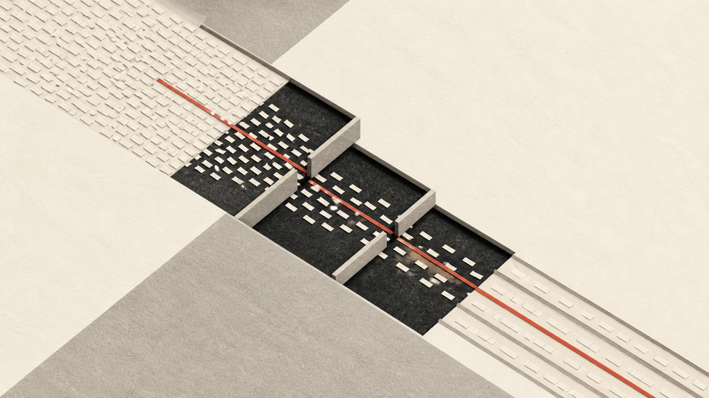

Most systems look healthy on an average day. A campaign launch or large commercial event is different because the traffic arrives with shared intent: everyone is trying to see, reserve, pay, or confirm the same thing at roughly the same time.

That does not only increase request volume. It changes the interactions inside the system. A slow dependency becomes a pile of waiting callers. A retry policy turns a short failure into extra load. Work that was harmless in a normal request path starts competing with the part the user actually came for.

## Scale changes the shape of failure

I think the useful question is less “can we handle N requests?” and more “what work will we still insist on doing synchronously when the system is under pressure?” That is where queues, caching, limits, idempotency, and graceful degradation stop being architecture vocabulary and become product decisions.

The sketch below is a deliberately small model of that question. Pick an event, add or remove protections, and watch where the pressure moves. It is not a capacity calculator; the values are not production measurements. It is a way to make the request path concrete enough to argue about it.

## Things I would look for before an event

- The smallest path that still gives a user a useful outcome.
- Dependencies that can be deferred, skipped, or made asynchronous.
- Retry behavior, especially where a timeout can make the original spike wider.
- A way to reject or slow work deliberately instead of failing accidentally.

The rest of this article is also a draft. It needs a few real event stories and the trade-offs behind them, not a generic checklist about autoscaling.
